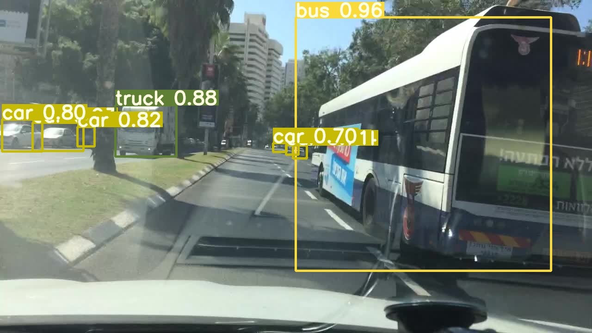

# Real time object detection with YOLOv3 in urban street scenes

## Introduction

Alongside accuracy and recall, computational cost is the most important performance criterion to be optimized in object detection because many applications demand real time detection.

The development of predicting bounding boxes for object detection started with the sliding window approach, which, while predicting appropriate bounding boxes, is very computationally expensive. Later models use selective search (in RCNNs) or region proposal networks (in Faster - RCNNs) - vastly reduced computational cost. YOLO and its derivatives, YOLO9000 and YOLOv3, offer state of the art prediction accuracy and leading real time performance (frames per second). In this project we explore the performance of the YOLOv3 model for detecting objects in street scenes.

## Motivation - Why should we detect objects (in street scenes)?

Object detection has a variety of applications, with the most popular being: transportation (e.g. autonomous driving), consumer electronics (e.g. face detection in smartphones), surveillance (e.g. face detection in shop surveillance cameras).

Street scenes are interesting subjects for object detection since they present multiple classes and varying conditions in lighting, landscape, surroundings, weather and season of year.

## Data set

2D Bounding boxes annotated on 100.000 images for bus, traffic light, traffic sign, person, bike, truck, motor, car, train and rider.

Berkeley Deep Drive data-set contains urban street scenes captured by dashboard cameras in cars. The data set contains images for day and night scenes and varying weather conditions. Furthermore, different cameras have been used to capture the footage, resulting in varying image quality.

Setup
- 70% of data used for training
- 10% of data used for validation
- 20% of data used for testing

Hardware
- Nvidia Tesla K80 - 11GB of VRAM
- 4 Virtual CPUs
- 15 GB ddr4 - RAM

## Predicting Bounding Boxes - You only look once

The idea behind YOLO is to simultaneously predict multiple possible bounding boxes, the confidence for the box that it contains an object and the class probabilities in a single network.

Steps of predicting Anchor Boxes:
1. Divide Image into grid of S x S at some output within the CNN
2. Fully convolutional Layers ( [ 1 x 1 ] - Kernel): each cell predicts B anchor boxes and corresponding class probabilities as well as an objectiveness score
3. Output is S x S x B x (5 + C) Tensor
4. Repeat prediction on 2 more scales to predict small and big objects

## CNN Architecture

| Architecture 	| Top - 1 	| Top - 5 	| FPS 	|
|--------------	|---------	|---------	|-----	|
| Darknet - 19 	| 74.1    	| 91.8    	| **171** 	|
| ResNet - 101 	| 77.1    	| 93.7    	| 53  	|
| ResNet - 152 	| **77.6**    	| **93.8**    	| 37  	|
| DarkNet - 53 	| 77.2    	| **93.8**    	| **78**  	|

Comparison of different CNN feature extractors. All extractors have been trained on the same data and are evaluated at a resolution of 288x288 on a TitanX - GPU. Reprinted from Yolov3: an incremental improvement [Redmon and Farhadi, 2018]

#### Darknet - 53

- 53 convolutional layers
- Shortcut layers to keep different resolutions
- Routing layers for multiscale predictions

Implementation of own backbone to trade-off between FPS and performance.

#### Own Backbone:

- 33 convolutional layers
- Less GPU memory for training

## Results and Evaluation

- Training for 60 epochs with input size of 352 x 352
- Multiscale training until epoch 80 # TODO: edit epoch nr. Scales: [288, 320, 352, 384, 416, 448, 480, 512, 544, 576, 608]
- Validation after every epoch
- Testing after final training

#### Validation

3 Groups of objects:
- Car, bus, truck
- Traffic light, traffic sign
- Bike, motor, rider, person

| Class         	| Number of Instances 	| mAP   	|
|---------------	|---------------------	|-------	|
| Car           	| 1.03e+05            	| 0.557 	|
| Traffic light 	| 2.69e+04            	| 0.206 	|
| Traffic sign  	| 3.49e+04            	| 0.280 	|
| Person        	| 1.33e+04            	| 0.312 	|
| Truck         	| 4.24e+03            	| 0.302 	|
| Bus           	| 1.6e+03             	| 0.281 	|
| Bike          	| 1.01e+03            	| 0.203 	|
| Rider         	| 649                 	| 0.224 	|
| Motor         	| 452                 	| 0.136 	|
| Train         	| 15                  	| 0.000 	|

#### Final Results on Test Set

Comparison with competing models (from BDD competition)

| Team       	| Mean Average Precision 	|
|------------	|------------------------	|
| Sogou_MM   	| 33.10                  	|
| ICST & Ali 	| 29.69                  	|
| seb        	| 20.66                  	|
| Max & Oli(ours)  	| 25.00                    	|

Example Outputs:

